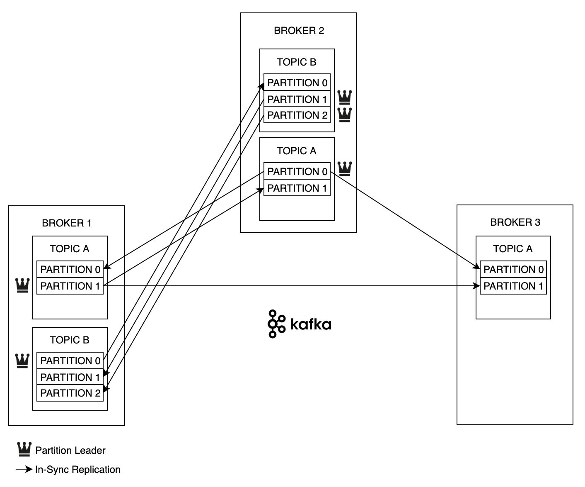
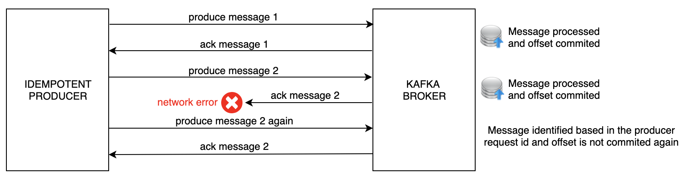
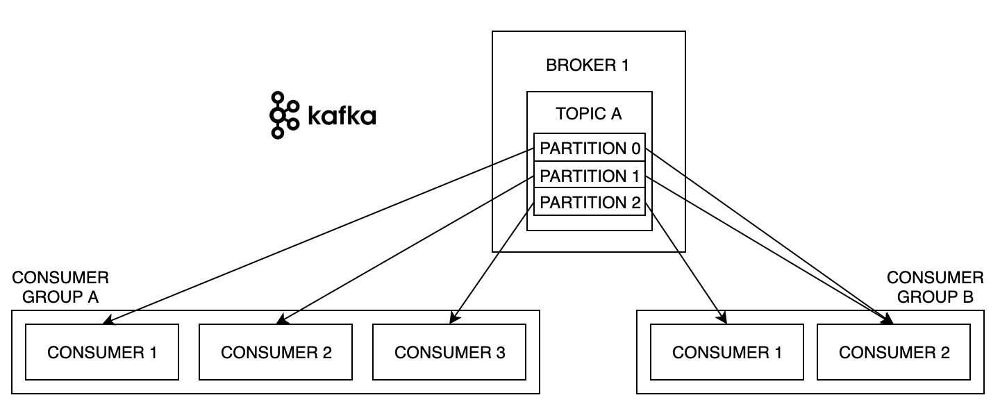
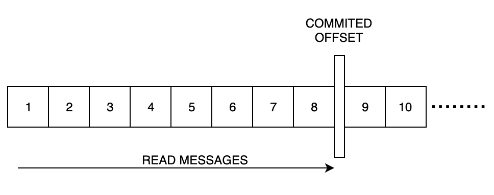
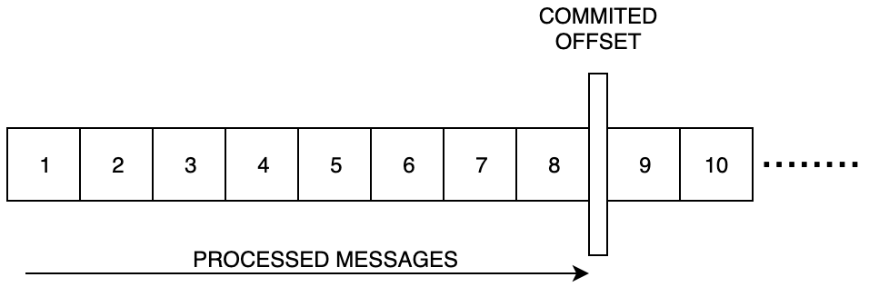

# Introduction
This is a Java project that has examples of big Apache Kafka, it is used as example in my blog [blog tutorials](https://marcusvieira.tech/2019/07/09/apache-kafka-tutorial/) tutorials.

# Kafka
Apache Kafka is an open-source distributed stream platform written in Java and Scala. It was developed by LinkedIn and become part of Apache Software Foundation projects in 2012.

As a distributed streaming platform, Kafka has three main abilities:

- Publish and subscribe to streams of records.
- Process streams of records as they occur.
- Store streams of records in a fault-tolerant durable way.

The Kafka platform runs as a cluster that can have one or more servers, it stores streams of records that are called topics, these records are composed by a key, value and timestamp.

The four Kafka core APIS are:

- The Producer API allows an application to publish a stream of records to one or more Kafka topics.
- The Consumer API allows an application to subscribe to one or more topics and process the stream of records produced to them.
- The Streams API allows an application to act as a stream processor, consuming an input stream from one or more topics and producing an output stream to one or more output topics, effectively transforming the input streams to output streams.
- The Connector API allows building and running reusable producers or consumers that connect Kafka topics to existing applications or data systems. For example, a connector to a relational database might capture every change to a table.

## TOPICS

It is a particular stream of data, similar to a table in the database. It has a name and usually the topic is replicated between brokers to build a fault-tolerant architecture.

The topics are split in partitions, each partition is ordered and when it receives a message the partition gets an incremental id called offset.

The message order is guaranteed only within a partition. The data is kept in the topic only for a limited time (in a Kafka version 2.0.0 the default retention period is 7 days).

Data in Kafka is immutable, it means that it is not possible to change the message content. By default, the message is randomly assigned to a partition unless a key is provided.

## BROKERS
The Kafka cluster is composed of one or many brokers. It broker is identified by id (property broker.id).

A broker contains only a subset of the topics and after connect to it you will be connected to the entire cluster.

In the example below, we have a Kafka cluster with 3 brokers and 2 topics. The topic A has 2 partitions and replication factor equals 3 and the topic B has 3 partitions and replication factor equals 2, it means that the topic data of the topic B will be kept only in two brokers.

If a partition leader goes down the ISR (In-Sync Replica) becomes the leader.

If a new topic is created or a broker dies the zookeeper notifies the brokers, by design it operates an odd number of servers (3, 5, 7, 9).

It has a leader that handle the writes and the other zookeeper instances are followers that handles only the reads.

## PRODUCER
The producers publish the data to topics, they can send a message in three ways:

If a partition is specified in the record, use it.
If no partition is specified but a key is present it chooses a partition based on a hash (Kafka uses the murmur2 to hash the key) of the key.
If no partition or key is present it chooses a partition in a round-robin fashion.
Producers can choose to receive the acknowledgment of data writes:

acks = 0 : It will not wait for the write confirmation.
acks = 1 : It will wait for leader sends write confirmation.
acks = 2 : It will wait for leader and at least one replica (ISR) send the write confirmation. (e.g. min.insync.replicas=1)
acks = all : It will wait for leader and all replicas (ISR) send the write confirmation. (it add latency and safety).

### Idempotent Producer
Since Kafka version 0.11 we have some parameters to implement an idempotent producer (enable.idempotence equals true, retries equals Integer.MAX_VALUE), it means that if the producer for some reason send the same message twice, the Kafka Broker is able to recognize the duplication based the producer request id and avoid to commit the offset again.

### Producer Batch
If you need to archive better performance with higher amount of messages, you can work with a producer batch, it will wait to send a bulk message.

For implementing a producer batch you need to set the linger.ms (the time that the producer will wait before sending the batch message) and the batch.size (it is the max batch message size).

Also if the producer batch is needed, it is a good time to think about message compression, Kafka provides three compression types: GZIP, Snappy and LZ4.

## CONSUMER
Kafka consumers read data from topics, the data read order happens only in the partition level.

The consumer always belongs to a consumer group (that has a name), each record published to a topic is delivered to one consumer instance within each subscribing consumer group.

For example, if three instances have the same consumer group, then the partitions will be distributed over these three consumers, if new instances join the group they will take over some partitions from other members of the group and if an instance dies, its partitions will be distributed to the remaining instances.

Also if each consumer instance has different consumer group then the message will be broadcast to all consumers. If you have more consumers than partitions some consumers will be inactive.

Kafka stores the offset at which consumer group has been reading, it is kept in a topic named __consumer_offsets.

The consumers have two ways to commit the offset, the auto (by default enable.auto.commit is equal true and auto.commit.interval.ms is 5000) and manual commit (sync and async).

Consumers can choose to commit the offset using three delivery semantics:

At most once: It only guarantees that the message was received, it is implemented with enable.auto.commit equals true and a auto.commit.interval.ms not too high (default is 5000).

At least once: It guarantees that the message was processed, but don’t avoid to receive the same message twice, in this scenario is important implements an idempotent consumer. It is implemented with enable.auto.commit equals false and manual commitSync consumer method.

Exactly once: It guarantees that the message will be received only a once and processed only a once, it can be achieved for Kafka workflows using Kafka Stream API.

## SCHEMA REGISTRY
It helps us to keep the compatibility of our Kafka messages, if you are interested to know more about, you can read our previous post “Apache Avro, Schema Registry and Kafka”.

## KAFKA MANAGE TOOLS
For managing the Kafka cluster you can use the Kafka CLI that is provided by Apache or others such as Kafkacat or Kafkatool.
